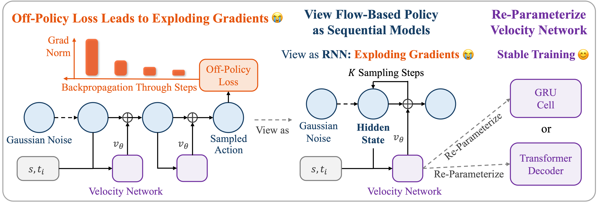

# SAC Flow: Sample-Efficient Reinforcement Learning of Flow-Based Policies via velocity-reparameterized sequential modeling

## Overview



SAC Flow is a stable, sample-efficient, and high-performance off-policy RL algorithm for flow-based policies. SAC Flow treats the flow-based model as a sequential model and reparameterizes its velocity network as a GRU or a Transformer.

## Get Start
All necessary dependencies and environment setup steps are detailed in our installation guide. Please follow the instructions in [setup](sacflow-setup.md) to prepare your environment. 


### From-scratch training

Run the corresponding file directly:
``` bash
cd from_scratch_code
```
Run SAC Flow-T:
``` bash
python SAC_flow_transformer_jax.py 
```

Run SAC Flow-G:
``` bash
python SAC_flow_gru_jax.py 
```

Run Naive SAC Flow
``` bash
python Naive_sac_flow_jax.py
```

### Offline-to-online training
``` bash
cd offline-to-online
```
Run SAC Flow-T:
``` bash
MUJOCO_GL=egl python main_action_reg_three_phase.py --run_group=reproduce --agent=agents/acfql_transformer_ablation_online_sac.py --agent.alpha=100 --env_name=cube-triple-play-singletask-task4-v0 --sparse=False --horizon_length=5
```

Run SAC Flow-G:
```bash
MUJOCO_GL=egl python main_action_reg_three_phase.py --run_group=reproduce --agent=agents/acfql_gru_ablation_online_sac.py --agent.alpha=100 --env_name=cube-triple-play-singletask-task4-v0 --sparse=False --horizon_length=5
```

Run Naive SAC Flow:
```bash
MUJOCO_GL=egl python main_action_reg_three_phase.py --run_group=reproduce --agent=agents/acfql_ablation_online.py --agent.alpha=100 --env_name=cube-triple-play-singletask-task4-v0 --sparse=False --horizon_length=5
```

Run QC-FQL:
```bash
MUJOCO_GL=egl  python main.py --run_group=reproduce --agent.alpha=100 --env_name=cube-triple-play-singletask-task4-v0 --sparse=False --horizon_length=5
```

Run FQL:
```bash
MUJOCO_GL=egl  python main.py --run_group=reproduce --agent.alpha=100 --env_name=cube-triple-play-singletask-task4-v0 --sparse=False --horizon_length=1
```

## Cite our work
```
@article{zhang2024sacflow,
  title={SAC Flow: Sample-Efficient Reinforcement Learning of Flow-Based Policies via Velocity-Reparameterized Sequential Modeling},
  author={Zhang, Yixian and Yu, Shu'ang and Zhang, Tonghe and Guang, Mo and Hui, Haojia and Long, Kaiwen and Wang, Yu and Yu, Chao and Ding, Wenbo},
  journal={arXiv preprint arXiv:XXXX.XXXXX},
  year={2024}
}
```

## Acknowledgments
This code is mainly developed based on the [cleanrl](https://github.com/vwxyzjn/cleanrl) (from-scratch training) and [QC-FQL](https://github.com/ColinQiyangLi/qc) (offline-to-online training). If you find our work useful, please consider citing their works as well.